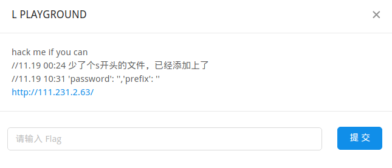

## LCTF2017C L_PLAYGROUND

### 0x00.LCTF2017

### 0X01.项目介绍

这个项目是LCTF2017的web题L_PLAYGROUND的开放源码。

- 搭建指南在`./doc/build.md`
- writeup在`./doc/writeup.md`

### 0x02.参考

[Advisory: HTTP Header Injection in Python urllib](http://blog.blindspotsecurity.com/2016/06/advisory-http-header-injection-in.html)

[Hack Redis via Python urllib HTTP Header Injection](https://security.tencent.com/index.php/blog/msg/106)

[掌阅iReader某站Python漏洞挖掘](https://www.leavesongs.com/PENETRATION/zhangyue-python-web-code-execute.html)

[Python 安全 - 从 SSRF 到命令执行惨案](http://paper.seebug.org/337/)

[谈一谈如何在Python开发中拒绝SSRF漏洞](https://www.leavesongs.com/PYTHON/defend-ssrf-vulnerable-in-python.html)

[SSRF漏洞中绕过IP限制的几种方法总结](http://www.freebuf.com/articles/web/135342.html)

[How I Chained 4 vulnerabilities on GitHub Enterprise, From SSRF Execution Chain to RCE!](http://blog.orange.tw/2017/07/how-i-chained-4-vulnerabilities-on.html)

[新型任意文件读取漏洞研究](http://wps2015.org/drops/drops/%E6%96%B0%E5%9E%8B%E4%BB%BB%E6%84%8F%E6%96%87%E4%BB%B6%E8%AF%BB%E5%8F%96%E6%BC%8F%E6%B4%9E%E7%9A%84%E7%A0%94%E7%A9%B6.html)

[三个案例看Nginx配置安全](https://www.leavesongs.com/PENETRATION/nginx-insecure-configuration.html)

### 0x03.后记

这个题目我觉得只能说一般，利用到的点都没有很新，也没有我独自发现的漏洞点。这道题也不是漏洞的生产者，只是漏洞的搬运工。

在布置环境里，疏忽之间就把sesstings的pyc给删了，导致失去了重要的线索，万幸没有给师傅们造成太大的影响。（毕竟这道题过去一个月了，很多地方都忘记了

还有比较坑爹的一点是，redis的配置内容，比如password、profix是假的，很尴尬。所以有了如下的描述：

万幸的是，LCTF2017顺利结束了。比赛期间(周末)过得很充实，事情很多2333。希望Lteam和XDSEC越来越好。